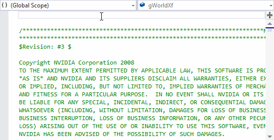
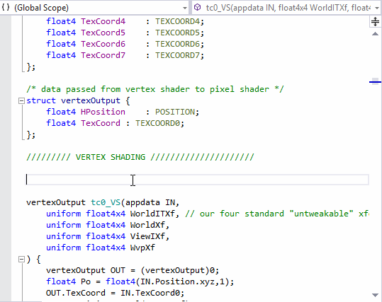
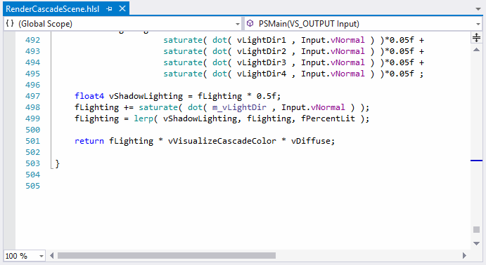
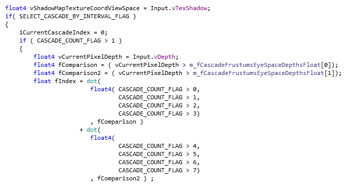
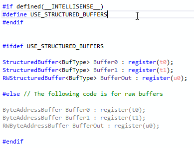
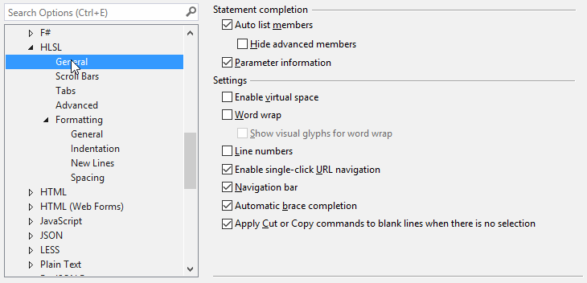
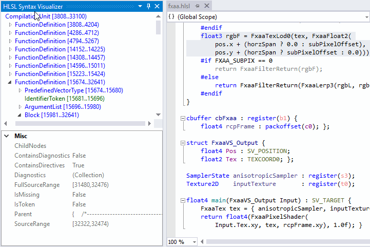

# HLSL Tools for Visual Studio

A Visual Studio extension that provides enhanced support for editing High Level Shading Language (HLSL) files.

Download the extension at the [VS Gallery](https://visualstudiogallery.msdn.microsoft.com/75ddd3be-6eda-4433-a850-458b51186658) 
or get the [nightly build](http://vsixgallery.com/extension/7def6c01-a05e-42e6-953d-3fdea1891737/).

See the [changelog](CHANGELOG.md) for changes and roadmap.

**HLSL Tools is currently pre-release software. I strongly recommend having a backup of your shaders before using HLSL Tools.
And if you do find a bug, please [log it](https://github.com/tgjones/HlslTools/issues).**

### Why use HLSL Tools?

Since Visual Studio 2012, Visual Studio has shipped with basic support for editing HLSL files.
In addition to that basic feature set, HLSL Tools includes many more navigational and editing features:

| VS2013 / VS2015      | VS2013 / VS2015 with HLSL Tools |
| -------------------- | ------------------------------- |
| Syntax highlighting  | Syntax highlighting             |
| Automatic formatting | Automatic formatting            |
| Brace matching       | Brace matching                  |
| Brace completion     | Brace completion                |
| Outlining            | Outlining                       |
|                      | [Navigation bar](#navigation-bar) |
|                      | [Navigate to (Ctrl+,)](#navigate-to) |
|                      | [Live syntax errors](#live-syntax-errors) |
|                      | [Go to definition](#go-to-definition) (currently only preprocessor macros) |
|                      | [Quick info](#quick-info) (currently only preprocessor macros) |
|                      | [Gray out code excluded by preprocessor](#preprocessor-support) |
|                      | [HLSL-specific preferences](#options) |

There are more features - most notably, IntelliSense-related features - [on the roadmap](CHANGELOG.md).

### Features

#### Navigation bar

#### Navigate To

HLSL Tools supports Visual Studio's Navigate To feature. Activate it with `Ctrl+,`, and start typing the name
of the variable, function, or other symbol that you want to find.

#### Live syntax errors

HLSL Tools shows you syntax errors immediately. No need to wait till compilation!
Errors are shown as squigglies and in the error list.

#### Go to definition

#### Quick info

#### Preprocessor support

HLSL Tools evaluates preprocessor directives as it parses your code, and grays out excluded code.
If you want to make a code block visible to, or hidden from, HLSL Tools, use the `__INTELLISENSE__` macro:

#### Options

### Extras

#### The code

HLSL Tools includes a [handwritten HLSL parser](https://github.com/tgjones/HlslTools/blob/master/src/HlslTools).
It initially used an ANTLR lexer and parser,
but the handwritten version was faster, and offered better error recovery.

HLSL Tools has a reasonable test suite - although it can certainly be improved. Amongst more granular tests,
it includes a suite of 433 shaders, including all of the shaders from the DirectX and Nvidia SDKs.
If you want to contribute gnarly source files which push HLSL to its limit, that would be great!

#### Syntax visualizer

Inspired by Roslyn, HLSL Tools includes a syntax visualizer. It's primarily of interest to HLSL Tools developers,
but may be of interest to language nerds, so it's included in the main extension. Open it using `View > Other Windows > HLSL Syntax Visualizer`.

### Getting involved

You can ask questions regarding the project on [GitHub issues](https://github.com/tgjones/HlslTools/issues)
or on Twitter (tweeting to [@roastedamoeba](https://twitter.com/roastedamoeba) and
[#hlsltools](https://twitter.com/hashtag/hlsltools) hashtag).

Contributions are always welcome. [Please read the contributing guide first.](CONTRIBUTING.md)

### Maintainer(s)

* [@tgjones](https://github.com/tgjones)

### Acknowledgements

* Much of the code structure, and some of the actual code, comes from [Roslyn](https://github.com/dotnet/roslyn).
* [NQuery-vnext](https://github.com/terrajobst/nquery-vnext) is a nice example of a simplified Roslyn-style API,
  and HLSL Tools borrows some of its ideas and code.
* [Node.js Tools for Visual Studio](https://github.com/Microsoft/nodejstools) and
  [Python Tools for Visual Studio](https://github.com/Microsoft/PTVS) are amongst the best examples of how to build
  a language service for Visual Studio, and were a great help.
* [ScriptSharp](https://github.com/nikhilk/scriptsharp) is one of the older open-source .NET-related compilers,
  and is still a great example of how to structure a compiler.
* [LangSvcV2](https://github.com/tunnelvisionlabs/LangSvcV2) includes many nice abstractions for some of the more
  complicated parts of Visual Studio's language service support.
  